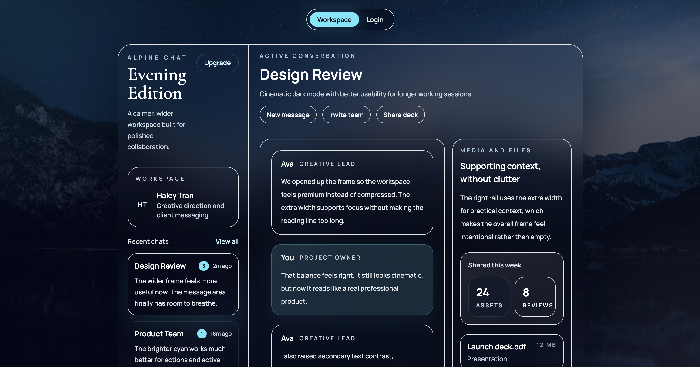

# Real-Time Chat App (Full-stack) — In Progress

A full-stack chat application focused on building production-style authentication and a clean, scalable backend foundation for real-time messaging.



## Licence

This project is licensed under the MIT License. See [LICENSE](/Users/haleytran/Desktop/chatApp/LICENSE) for details.

## Current Milestone 

Auth and the real-time chat flow are working end-to-end with:

- signup, login, logout
- hashed passwords
- JWT stored in `HttpOnly` cookies
- sidebar user loading
- conversation history loading
- HTTP message sending
- Socket.IO event-driven real-time message delivery
- live online presence updates
- typing indicators
- unread counts for inactive conversations
- timestamps, auto-scroll, and Enter-to-send composer UX
- instant UI updates across active user sessions

## Best Demo Method

Recommended demo flow:

1. Open the deployed frontend.
2. Create two demo accounts, or use two seeded/demo accounts if available.
3. Open User A in a normal browser window and User B in an incognito window or another browser.
4. Select each user from the sidebar.
5. Send a message, show it arriving live, type in the composer, show the typing indicator, then switch conversations to show unread badges.


## Stack

- Frontend: React (Vite), Tailwind CSS, daisyUI, Socket.IO client
- Backend: Node.js, Express, Socket.IO
- Database: MongoDB Atlas, Mongoose
- Auth: JWT, bcryptjs, cookie-based sessions

## Why This Project

This project is built to practice real engineering skills:

- designing a modular Express backend
- implementing authentication in a secure, realistic way
- using environment configuration safely across development and production
- testing APIs with reproducible command-line requests
- building a polished frontend on top of a practical backend foundation

## Important Backend Implementations

- `backend/controllers/auth.controller.js`
  Handles signup, login, and logout logic.
- `backend/utils/generateToken.js`
  Creates the JWT and stores it in an `HttpOnly` cookie.
- `backend/middleWare/protectRoutes.js`
  Protects private routes by validating the JWT and attaching the authenticated user to the request.
- `backend/routes/auth.routes.js`
  Defines auth endpoints.
- `backend/routes/user.routes.js`
  Includes protected user-fetching logic for the chat sidebar.
- `backend/routes/message.routes.js`
  Includes protected message sending.
- `backend/controllers/message.controller.js`
  Creates messages, links them to conversations, and emits real-time message events after persistence.
- `backend/socket/socket.js`
  Attaches Socket.IO, tracks online users, joins each user to their own room, and relays typing events.
- `backend/models/user.models.js`
  Stores user account data.
- `backend/models/conversation.model.js`
  Stores chat participants and conversation message references.
- `backend/models/message.model.js`
  Stores individual chat messages.
- `backend/db/connectToMongoDB.js`
  Centralised database connection logic.

## Implemented Features

### Authentication

- Signup creates a user in MongoDB
- Login verifies credentials and authenticates the user
- Logout clears the authentication cookie immediately

### Security Measures

- Password hashing with `bcryptjs`
- JWT stored in cookies instead of `localStorage`
- `HttpOnly` cookie flag to reduce token theft through XSS
- `SameSite=Lax` locally and `SameSite=None; Secure` in production for deployed frontend/backend origins
- `Secure` cookie flag enabled automatically outside development
- Basic message validation for receiver id, receiver existence, blank messages, and maximum message length
- Helmet security headers on the backend API
- Rate limits on auth and message endpoints to reduce brute-force and spam risk
- Socket.IO authenticates the existing JWT cookie before joining user rooms or broadcasting presence
- Vercel frontend security headers, including a Content Security Policy for script-injection protection

### Backend Foundation

- Modular backend structure with routes, controllers, models, utilities, and middleware
- MongoDB connection through environment variables
- JSON request parsing enabled with `express.json()`
- Protected route middleware for authenticated requests
- Message and conversation models powering chat persistence
- Socket.IO attached to the same HTTP server as Express
- Event-driven message delivery reduces the need for repeated HTTP polling

### Frontend Progress

- Cinematic dark workspace UI
- Matching luxury dark login screen
- Laptop-sized layout polished for real browser use
- Workspace connected to live users, history, and real-time incoming messages
- Online presence badges in the conversation list
- Low-latency chat experience with instant message updates, typing indicators, unread counts, and auto-scroll

## API Endpoints

Base URL (local): `http://localhost:5000`

| Method | Route | Description |
| --- | --- | --- |
| POST | `/api/auth/signup` | Create account and set JWT cookie |
| POST | `/api/auth/login` | Login and set JWT cookie |
| POST | `/api/auth/logout` | Logout and clear JWT cookie |
| GET | `/api/user/` | Get users for sidebar (protected) |
| GET | `/api/message/:id` | Get shared conversation history with a user (protected) |
| POST | `/api/message/send/:id` | Send message to a user by id (protected) |

## Project Structure

```text
backend/
  controllers/
    auth.controller.js
    message.controller.js
    user.controller.js
  db/
    connectToMongoDB.js
  middleWare/
    protectRoutes.js
  models/
    conversation.model.js
    message.model.js
    user.models.js
  routes/
    auth.routes.js
    message.routes.js
    user.routes.js
  socket/
    socket.js
  utils/
    generateToken.js
  server.js

frontend/
  public/
  src/
    pages/
      home/
      login/
      signup/
    context/
      SocketProvider.jsx
      socketContext.js
      useSocket.js
    App.jsx
    index.css
    main.jsx
```

## Local Setup

### 1. Install dependencies

```bash
npm install
cd frontend
npm install
```

### 2. Create `.env` in the project root

```bash
# Local backend port
PORT=5000

# Frontend origin allowed to send cookie-based requests to the API
CLIENT_URL=http://localhost:5173

# Use "development" locally and "production" when deployed
NODE_ENV=development

# MongoDB connection string
MONGO_URI=your_mongodb_connection_string

# A long random secret used to sign JWT auth cookies
JWT_SECRET=your_secret
```

You can copy from `.env.example`.
Never commit your real `.env` file or paste live secrets into the repository.

### 3. Create frontend env values

Create `frontend/.env`:

```bash
VITE_API_BASE_URL=http://localhost:5000/api
VITE_SOCKET_SERVER_URL=http://localhost:5000
```

You can copy from `frontend/.env.example`.

### 4. Run the backend

```bash
npm run server
```

You should see logs like:

- `Connected to mongoDB`
- `Server running on port 5000`

### 5. Run the frontend

```bash
cd frontend
npm run dev
```

Frontend usually runs on `http://localhost:5173`


Backend environment variables:

```bash
PORT=5000
CLIENT_URL=https://your-frontend.vercel.app
NODE_ENV=production
MONGO_URI=your_mongodb_connection_string
JWT_SECRET=your_long_random_secret
```

Frontend environment variables:

```bash
VITE_API_BASE_URL=https://your-backend-host.com/api
VITE_SOCKET_SERVER_URL=https://your-backend-host.com
```

Important:

- In deployed environments, both frontend variables must be set explicitly.
- The frontend only falls back to `localhost` during local development.
- If they are missing in production, the app now shows a clear configuration error instead of hanging on `Restoring session...`

Deployment checklist:

- Set `CLIENT_URL` to the deployed frontend origin exactly.
- Set the frontend `VITE_*` variables to the deployed backend origin.
- Keep `.env` files out of Git; use the host dashboard for secrets.
- Confirm MongoDB Atlas allows the deployed backend to connect.
- Use `NODE_ENV=production` so auth cookies are sent with `SameSite=None; Secure` for cross-site frontend/backend deployments.
- Redeploy the frontend after changing any `VITE_*` environment variables.
- If the backend host is known, tighten `frontend/vercel.json` `connect-src` from broad `https: wss:` to the exact backend HTTPS and WSS origins.

## Recommended Deployment Path

Use two services:

- Frontend: Vercel, because the Vite app builds into static files and `frontend/vercel.json` already defines frontend security headers.
- Backend: Render, Railway, Fly.io, or another Node web-service host that supports long-running Express servers and WebSocket upgrades. Do not deploy this backend as a serverless function because Socket.IO needs a persistent server process.

### Backend on Render

Create a Render Web Service from the repository:

```text
Root directory: .
Build command: npm install
Start command: npm start
```

Set backend environment variables in the host dashboard:

```bash
NODE_ENV=production
MONGO_URI=your_mongodb_atlas_connection_string
JWT_SECRET=your_long_random_secret
CLIENT_URL=https://your-frontend.vercel.app
```

Render provides the public port through `PORT`, and the backend already reads `process.env.PORT`.

### Frontend on Vercel

Create a Vercel project from the same repository:

```text
Root directory: frontend
Build command: npm run build
Output directory: dist
```

Set frontend environment variables in Vercel:

```bash
VITE_API_BASE_URL=https://your-backend-host.com/api
VITE_SOCKET_SERVER_URL=https://your-backend-host.com
```

After the backend URL is final, update backend `CLIENT_URL` to the exact Vercel production URL, then redeploy the backend. After changing any `VITE_*` variable, redeploy the frontend because Vite embeds those values at build time.

### MongoDB Atlas

Before the final demo:

- Add the backend host's outbound IPs if your Atlas project uses IP allowlists, or use Atlas settings appropriate for a short demo.
- Confirm the database user has only the permissions needed for this app.
- Keep `MONGO_URI` and `JWT_SECRET` in hosting dashboards only, never in Git.

## How To Use / Test

### Browser flow

You can use the browser UI to sign up, log in, and chat. Curl is only included below for optional backend API checks.

1. Start the backend with `npm run server`.
2. Start the frontend with `cd frontend` then `npm run dev`.
3. Open `http://localhost:5173`.
4. Create an account or log in through the UI.
5. Create or log in to a second account from a separate browser session.
6. Select the other user in each sidebar, then send messages to test live delivery.

**Important:** use two separate browser sessions for two logged-in users because JWT auth is stored in an `HttpOnly` cookie for `localhost`. Two standard tabs in the same browser profile share the same cookie, so the most recent login will replace the earlier login for that browser profile. If both tabs are from the same profile, they may look like two users visually, but API requests will belong to the most recently logged-in account.

**Recommended local real-time test options:**

- Chrome standard window for User A and Chrome incognito for User B
- Chrome for User A and Safari/Firefox/Edge for User B
- Two separate Chrome profiles

Expected real-time behaviour:

- New messages appear immediately in the receiver's active conversation without refreshing.
- The receiver can see typing feedback while the sender is composing.
- Inactive conversations show unread badges when real-time messages arrive.
- Online users show presence indicators in the sidebar.

### Optional API checks

Curl is useful for checking the backend directly, but it is not required for normal app usage.

### Signup

```bash
curl -i -X POST "http://localhost:5000/api/auth/signup" \
  -H "Content-Type: application/json" \
  -d '{"fullName":"your-name","username":"you","password":"123456","confirmPassword":"123456","gender":"female"}'
```

Look for:

- `HTTP/1.1 201 Created`
- `Set-Cookie: jwt=...; HttpOnly; SameSite=Lax; ...` locally, or `SameSite=None; Secure` in production

### Login

```bash
curl -i -c cookies.txt -X POST "http://localhost:5000/api/auth/login" \
  -H "Content-Type: application/json" \
  -d '{"username":"you","password":"123456"}'
```

### Logout

```bash
curl -i -b cookies.txt -c cookies.txt -X POST "http://localhost:5000/api/auth/logout"
```

Look for:

- `Set-Cookie: jwt=; Max-Age=0; ...`
- `{"message":"Logged out successfully"}`

## Current Status

### Done

- Backend and DB connection
- User model
- Auth routes and controllers
- Signup, login, and logout working
- JWT cookie auth utility
- Password hashing
- Protected route middleware
- Sidebar user fetching
- Persistent conversation history
- HTTP message sending
- Socket.IO real-time message delivery
- Online presence
- Typing indicators
- Unread counts for inactive conversations
- Message timestamps, auto-scroll, and Enter-to-send
- Shared socket state through a frontend socket context/provider
- Polished workspace and login UI

### In Progress

- Improving mobile-specific layout and spacing
- Hardening error states and empty states

### Planned

- Pagination for chat history
- Better frontend validation and error states
- Public deployment

## Notes (Security + Dev Environment)

- In development on localhost, cookies may show `Secure=false` depending on config.
- In production, cookies use `Secure=true` and `SameSite=None` so the deployed frontend can call the deployed backend with credentials over HTTPS.
- JWT is intentionally stored in cookies instead of `localStorage`.
- Protected routes depend on the auth cookie being sent with the request.
- React renders message text as escaped text rather than raw HTML; avoid adding `dangerouslySetInnerHTML` unless content sanitisation is introduced first.
